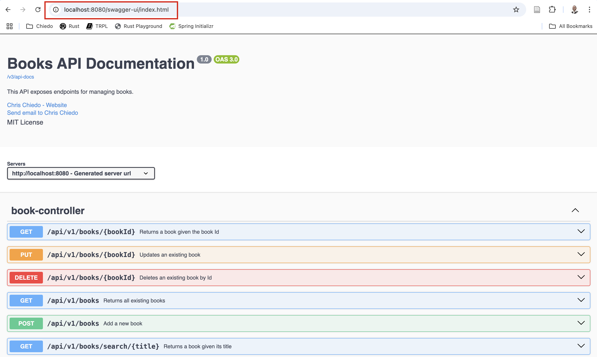

# Book REST API project

This project implements a simple REST API using the [Spring Boot](https://spring.io/projects/spring-boot) framework.

Check out the companion blog post: [How to deploy a Spring Boot application on a local Kubernetes cluster with minikube](https://chrischiedo.github.io/java-spring-boot-kubernetes-minikube).

## Running the application locally

The first step is to clone the project:

```bash
$ git clone https://github.com/chris-chiedo/books-rest-api-spring-boot.git
```

After cloning the project, change into the project's root directory and then build and run the project using the Spring Boot Maven plugin:

```bash
$ cd books-rest-api-spring-boot
$ ./mvnw spring-boot:run
```

## Checking out OpenAPI/Swagger documentation

Visit http://localhost:8080/swagger-ui/index.html on your browser to view the Swagger documentation for the API:

