# A Simple Books REST API Project

## Understanding the Books REST API app
The Books REST API project is a simple [Spring Boot](https://spring.io/projects/spring-boot) application built using the [Gradle](https://gradle.org/) build tool. The API allows one to perform the usual CRUD operations on a collection of books stored in an in-memory database (H2).

## Project Dependencies

| Dependency          | Purpose                                                                            |
|---------------------|------------------------------------------------------------------------------------|
| Spring web          | Building the RESTful web service following MVC pattern                             |
| Spring Data JPA     | Data persistence and ORM capabilities                                              |
| H2 Database         | In-memory data storage                                                             |
| Lombok              | Reduce boilerplate code (e.g. skip defining getters/setters/constructors manually) |
| Spring Security     | Provide basic authentication                                                       |
| Spring Actuator     | Provide app health monitoring                                                      |
| Springdoc-openapi   | Provide Swagger documentation (OpenAPI 3.0)                                        |
| Hibernate Validator | Bean validation                                                                    |

>Note: The project uses Spring Boot 3.1.5 and Java 17.

## Running the application locally

There are a few different ways of running the app locally.

The first step is to clone the project:
```
$ git clone https://github.com/chris-chiedo/books-rest-api-spring-boot.git
```
### Option 1:
After cloning the project, change into the project's root directory and then build and run the project using the Spring Boot Gradle plugin: 
```
$ cd books-rest-api-spring-boot
$ ./gradlew bootRun
```
>Note: In this case, we are using the gradle wrapper(gradlew) that allows you to run gradle commands without installing gradle locally.

You can then access the api at http://localhost:8080/

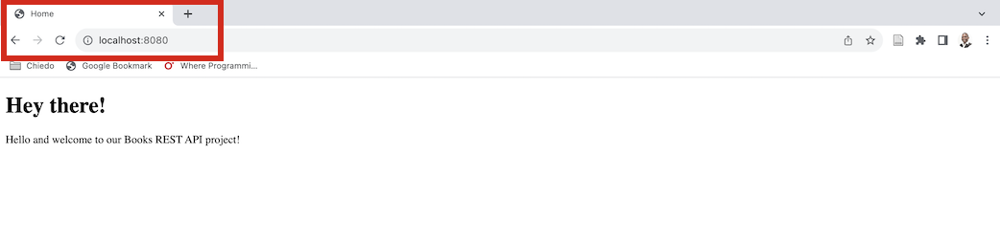

### Option 2:
You can build a jar file and run it from the terminal:
```
$ ./gradlew build
$ java -jar build/libs/books-rest-api-0.0.1-SNAPSHOT.jar
```

You can then access the api at http://localhost:8080/

>Note: You can also build a jar file for the app by using `./gradlew assemble`.

### Option 3:
You can open the project in your favorite Java IDE and run it from there.

## Running the tests
To run the tests, execute the following command from the terminal:
```
$ ./gradlew test
```

## Checking out the api documentation

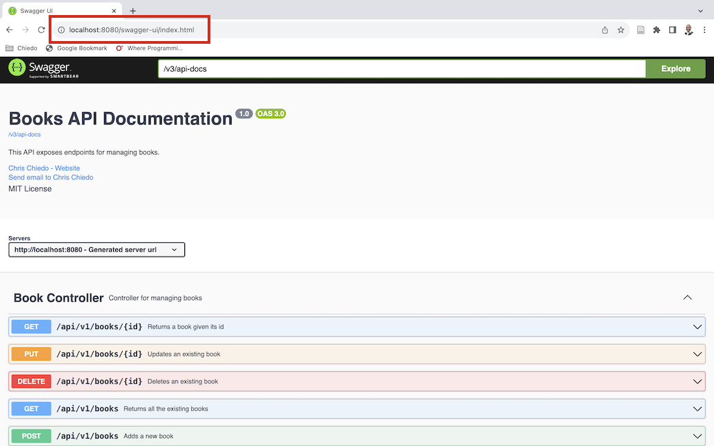

## Loading initial data into the database

In order for us to start interacting with the api quickly, we can load sample data into our database. In Spring Boot, we use a schema file (`schema.sql`) to define our database schema and a data file (`data.sql`) to load the actual data into the database. Check the sample files below:

### Sample `schema.sql` file
```sql
DROP TABLE users IF EXISTS;
DROP TABLE books IF EXISTS;

CREATE TABLE users (
    id     BIGINT GENERATED BY DEFAULT AS IDENTITY PRIMARY KEY,
    username    VARCHAR(50) NOT NULL,
    password    VARCHAR(256) NOT NULL,
    authority    VARCHAR(40) NOT NULL
);

CREATE TABLE books (
    id     BIGINT GENERATED BY DEFAULT AS IDENTITY PRIMARY KEY,
    title    VARCHAR(50) NOT NULL,
    author    VARCHAR(50) NOT NULL,
    description    VARCHAR(256) NOT NULL,
    isbn VARCHAR(50) NOT NULL
);
```

### Sample `data.sql` file
```sql
INSERT INTO books(title, author, description, isbn)
    VALUES ('Things Fall Apart', 'Chinua Achebe', 'A story of colonial Nigeria', '178-2-16');
INSERT INTO books(title, author, description, isbn)
    VALUES ('Animal Farm', 'George Orwell', 'A political satire', '422-5-19');
INSERT INTO users(username, password, authority)
    VALUES ('user1', 'pass1', 'ROLE_USER');
```
>Note: These sql files are usually stored in the `src/main/resources` directory.

## Sample API requests using Postman

### GET /api/v1/books

Querying for all books:

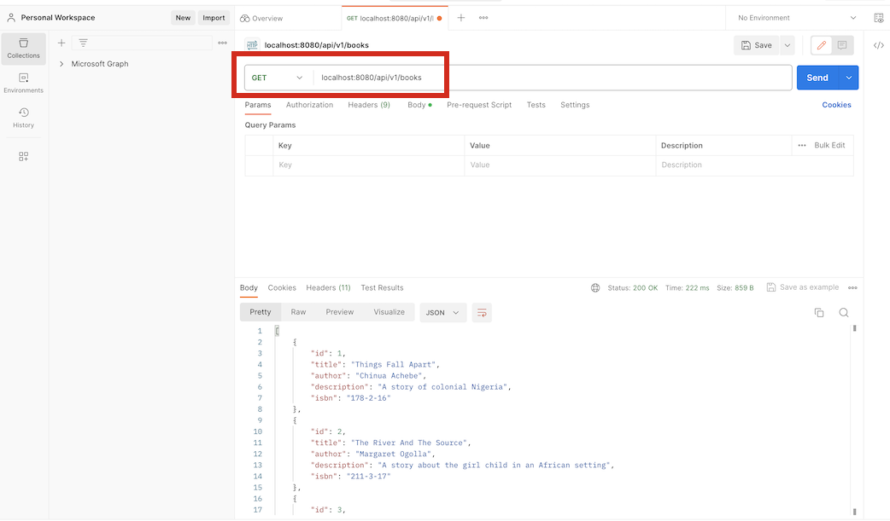

### GET /api/v1/books/2

Querying for a particular book by its id:

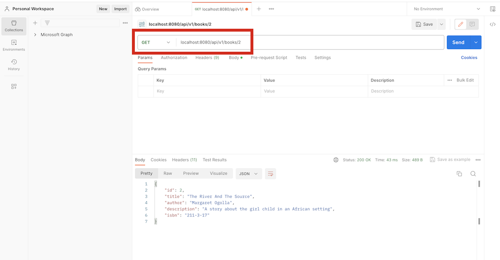

### GET /api/v1/books/search/Animal Farm

Searching a book by its title:

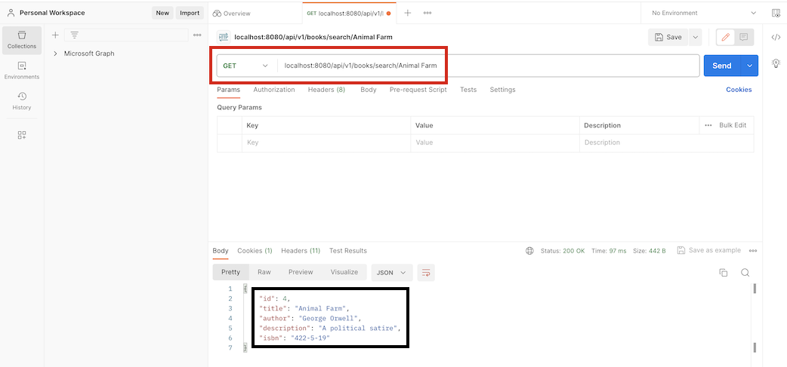

### POST /api/users/register

Registering as a new user:

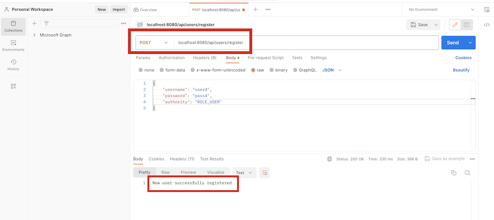

You can play around with the rest of the endpoints on your own.

## Deploying the app to a local Kubernetes cluster

In order for you to deploy the app to a locally hosted Kubernetes cluster, you'll need to install the following tools:

- Docker container runtime: allows you to work with Docker containers on your local machine. Check [Get Docker](https://docs.docker.com/get-docker/) to download Docker Desktop for your specific platform.
- `minikube`: lets you run a Kubernetes cluster locally. Check [minikube start](https://minikube.sigs.k8s.io/docs/start/) for installation instructions for your specific platform.
- `kubectl`: The Kubernetes command-line tool that allows you to run commands against a Kubernetes cluster. Check [kubectl](https://kubernetes.io/docs/tasks/tools/#kubectl) for installation instructions for your specific platform.


### Building a docker image for our application

There are a few approaches to creating a docker container image for a Spring Boot application:

- Using a Dockerfile (this is the option we'll use here)
- Directly from the Spring Boot Gradle plugin, using cloud native [buildpacks](https://buildpacks.io/).
```
$ ./gradlew bootBuildImage
```
- Using [Jib](https://github.com/GoogleContainerTools/jib). Here's a [Quickstart](https://github.com/GoogleContainerTools/jib/blob/master/jib-gradle-plugin#quickstart) for using the [jib-gradle-plugin](https://plugins.gradle.org/plugin/com.google.cloud.tools.jib).

#### Creating a Dockerfile

Here is a sample Dockerfile for the application.
>Note: Create the file in the root directory of the project: `$ touch Dockerfile`.

```dockerfile
FROM eclipse-temurin:17-jdk-alpine
VOLUME /tmp
EXPOSE 8080
COPY build/libs/books-rest-api-0.0.1-SNAPSHOT.jar books-rest-api-0.0.1-SNAPSHOT.jar
ENTRYPOINT ["java","-jar","/books-rest-api-0.0.1-SNAPSHOT.jar"]
```

>Note: We are using the `jar` file that was created from the build process (when we run `./gradlew build`). The jar file bundles all the dependencies together, including an embedded app server (Tomcat in this case). This is what is sometimes referred to as an "uber"/"fat" jar file.
> While we're using the fat jar file here, it often doesn't result in efficient container images. In order to make it easier to create optimized Docker images, Spring Boot supports a layering approach by adding a layer index file (`layers.idx`) to the jar. Check out [Packaging Layered Jar or War](https://docs.spring.io/spring-boot/docs/3.1.4/gradle-plugin/reference/htmlsingle/#packaging-executable.configuring.layered-archives) for more on this approach.

### Interlude
At this point, in order for us to work with Kubernetes, we would go ahead and build the container image (using the Dockerfile), and then push it to an image registry (e.g. [Dockerhub](https://hub.docker.com/)). This is mainly because Kubernetes pulls images from inside its Kubelets (nodes), which are not usually connected to the local docker daemon.

But because we want to run a Kubernetes cluster locally, we can create a local image registry to work with:
```
$ docker run -d -p 5000:5000 --restart=always --name registry registry:2
```
A container image registry is now running locally (`localhost`) on port 5000.

### Starting a local Kubernetes cluster

```
$ minikube start
```

Next, we need to allow Kubernetes to read our local docker image registry by executing the command below:

```
$ eval $(minikube -p minikube docker-env)
```

You can check the status of the minikube cluster with the following command:
```
$ minikube status
```
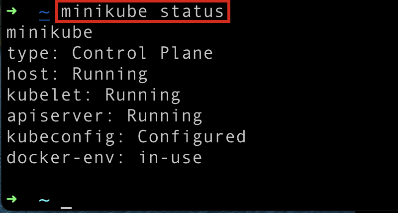

Note the `docker-env: in-use` line in the output. This indicates that our cluster can interact with our local docker environment.

>Note: You can also run `$ kubectl get nodes` to confirm that minikube is running an active node:

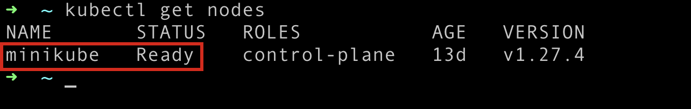

#### Building a container image from the Dockerfile

We can now build a docker image from the Dockerfile created above. From the project's root directory (where the Dockerfile is located), execute the following command:
```
$ docker build -t localhost:5000/books-rest-api:1.0 .
```
Note the period(`.`) at the end (means current directory where the Dockerfile is located).

You can check the image by running the following command:
```
$ docker images
```
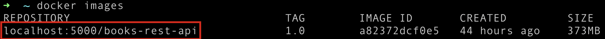

### Creating Kubernetes deployment file
Here's a sample deployment file (`deployment.yaml`):
```yaml
---
apiVersion: apps/v1
kind: Deployment
metadata:
  name: books-rest-api
spec:
  replicas: 2
  selector:
    matchLabels:
      app: books-rest-api
  template:
    metadata:
      labels:
        app: books-rest-api
    spec:
      containers:
        - name: books-rest-api
          image: localhost:5000/books-rest-api:1.0
          imagePullPolicy: IfNotPresent
          ports:
            - containerPort: 8080
---
```
With the deployment file in place, you can run the following command to deploy the application to our local cluster:
```
$ kubectl apply -f deployment.yaml
```
You can check the deployment status with:
```
$ kubectl get deployments
```
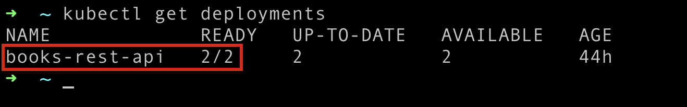

Since we set two replicas in our deployment, kubernetes will create two pods/instances for our application. We can get pods' information using:
```
$ kubectl get pods
```
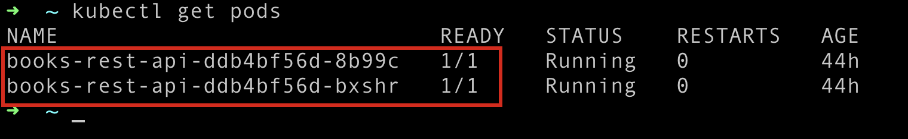

You can check the logs for the running pod(s):
```
$ kubectl logs books-rest-api-ddb4bf56d-8b99c
```
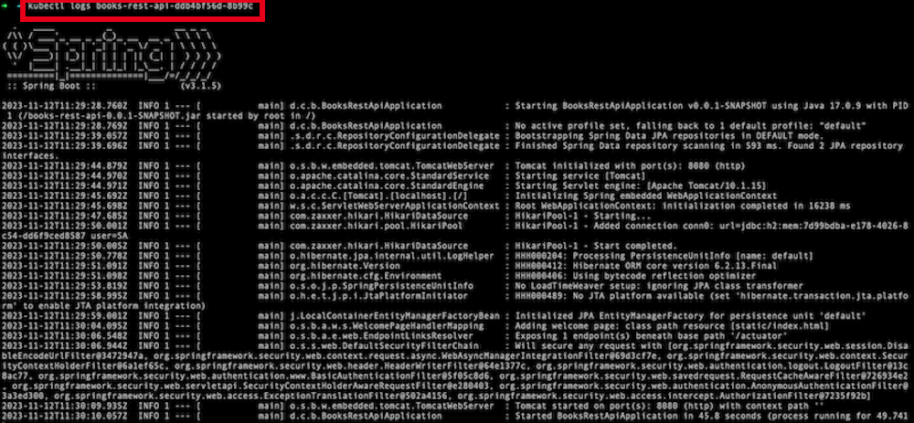

### Creating Kubernetes service file

To expose our deployed application as a service, you need to create a service file like the one below (`service.yaml`):
```yaml
---
apiVersion: v1
kind: Service
metadata:
  name: books-rest-api-service
spec:
  ports:
    - protocol: "TCP"
      port: 8080
      targetPort: 8080
  selector:
    app: books-rest-api
  type: NodePort
---
```
>Note: In a production environment, I'd probably use `LoadBalancer` as the service type (instead of `NodePort`).

We can now expose our app using the following command:
```
$ kubectl apply -f service.yaml
```
You can check the service status with:
```
$ kubectl get services
```
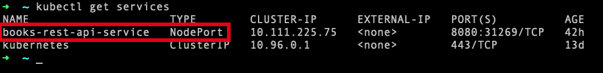

You can check the exposed services on the minikube cluster using:
```
$ minikube service list
```
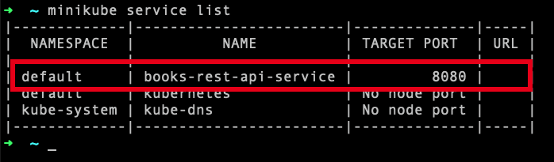

The access the pod(s), run the following command:
```
$ minikube service books-rest-api-service
```
This will create an SSH tunnel from the pod to your host and open a window in your default browser that is connected to the exposed service.

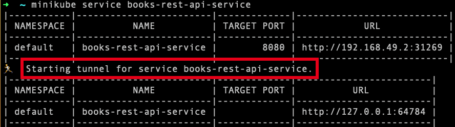

And here's the browser window:
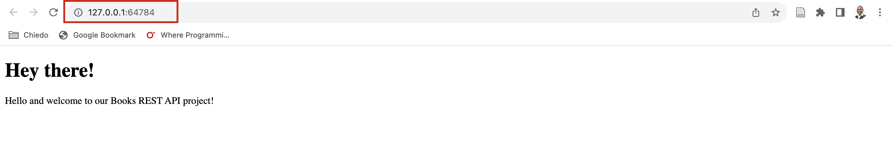

You can open the Kubernetes dashboard by executing the following command:
```
$ minikube dashboard
```
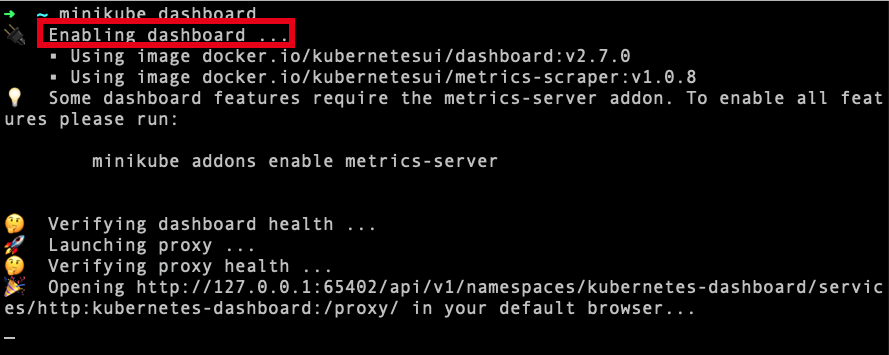

Here's how the dashboard looks like:

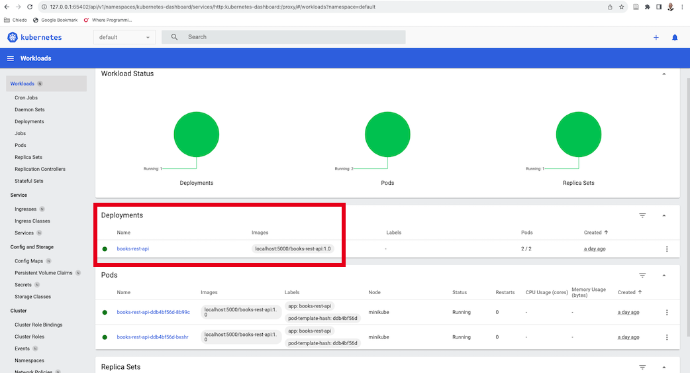

## Sample API calls using Postman

### GET /api/v1/books

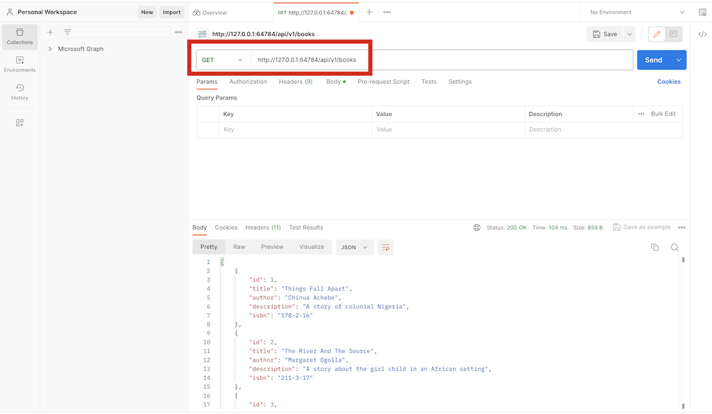

### GET /api/v1/books/3

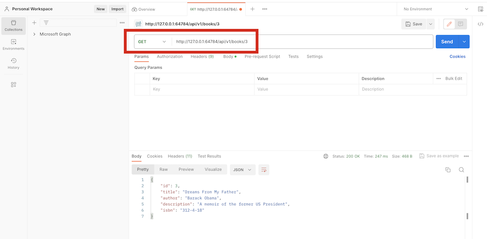

### POST /api/users/register

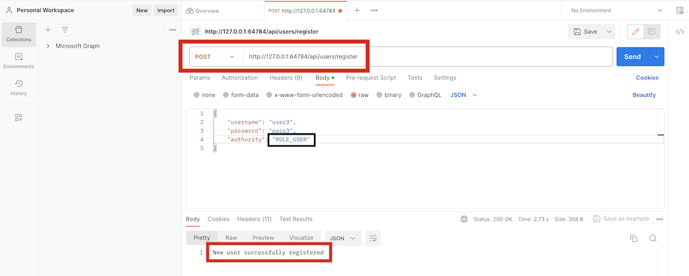

This creates a new user with the role of "USER".

### POST /api/users/register

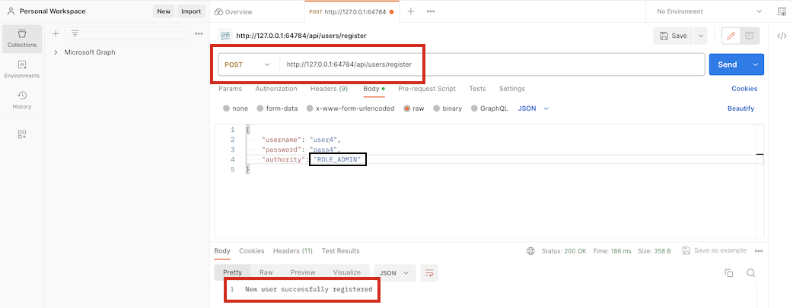

This creates a new user with the role of "ADMIN".

### GET /api/users

According to our auth configuration, only registered users with the role of "ADMIN" are allowed to access the list of registered users:

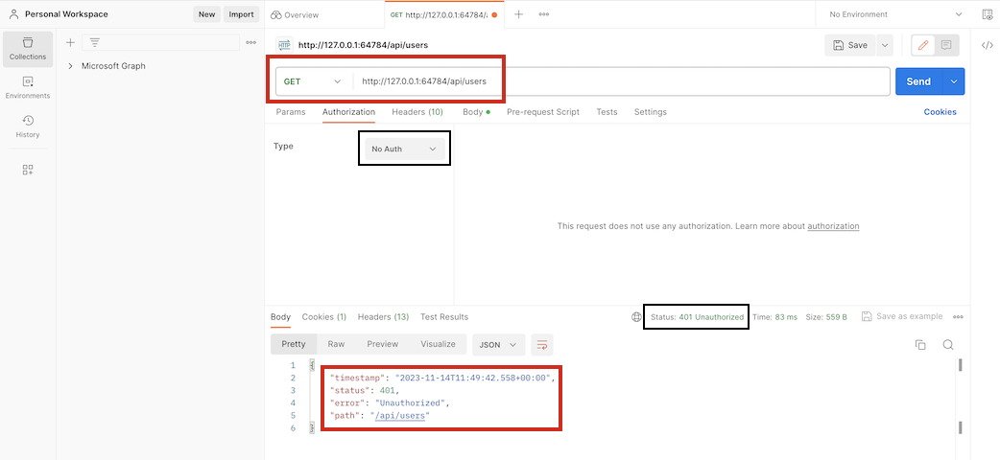

### GET /api/users

A registered user with a "USER" role is forbidden from accessing the list of users:

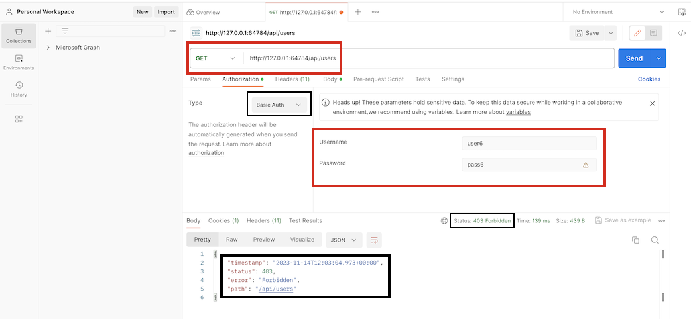

### GET /api/users

Only an "ADMIN" user can access the list of users:

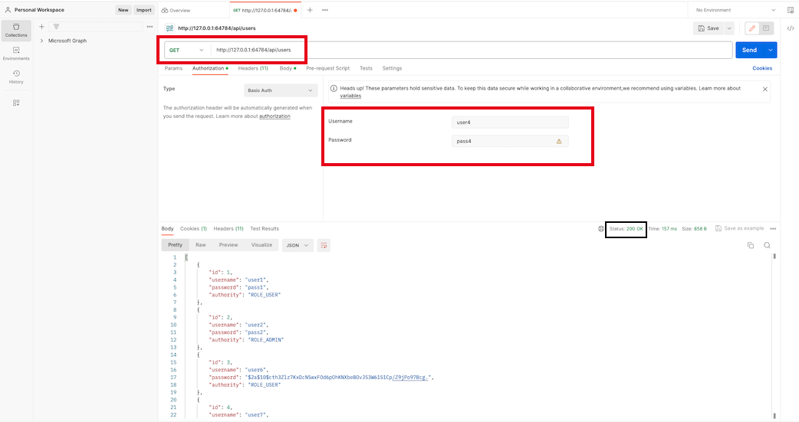

### POST /api/v1/books

An unregistered user isn't authorized to post a new book:

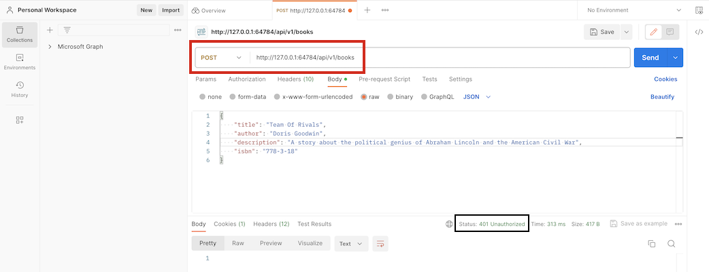

### POST /api/v1/books

A registered user can create a new book:

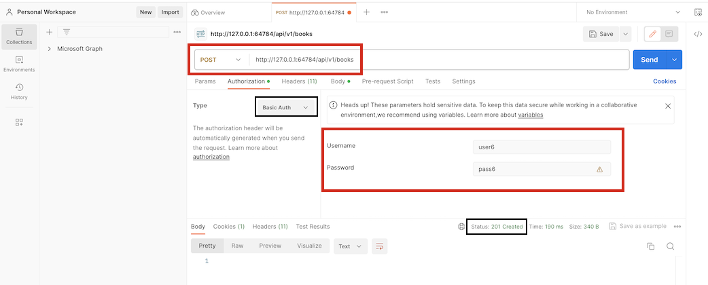

### GET /api/v1/books

You can check the newly created book:

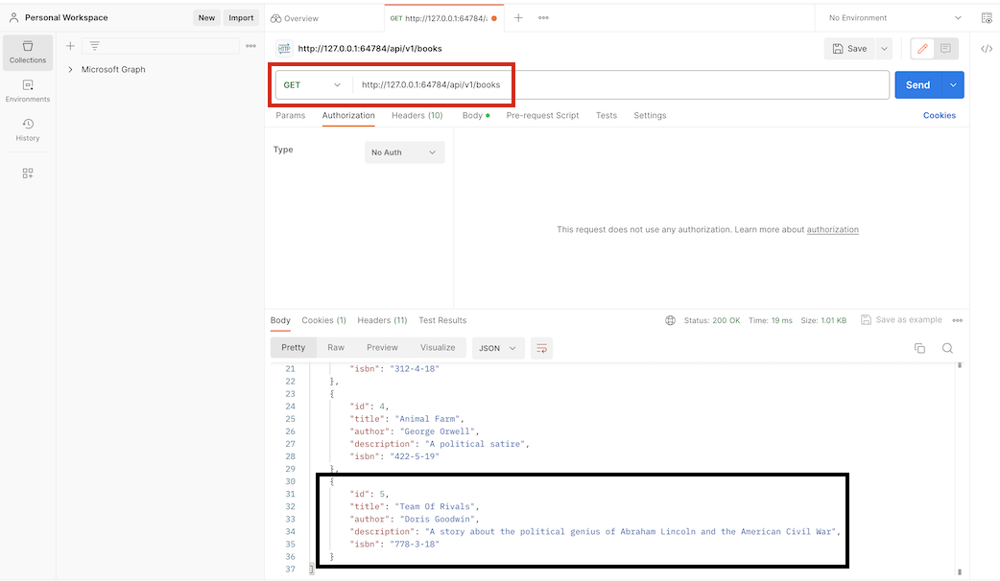

### DELETE /api/v1/books/5

An unregistered user isn't authorized to delete a book:

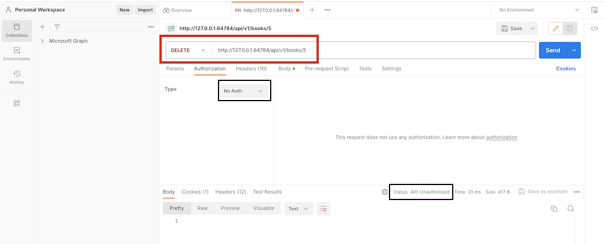

### DELETE /api/v1/books/5

A registered user with a "USER" role is forbidden from deleting a book:

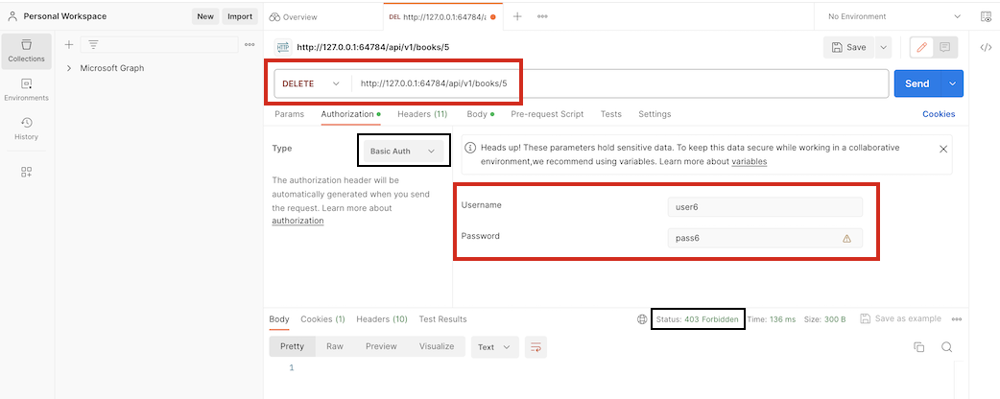

### DELETE /api/v1/books/5

Only a registered user with an "ADMIN" role is allowed to delete a book:

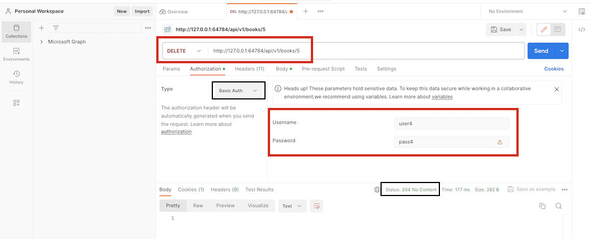

### GET /api/v1/books/5

Confirm that indeed the book has been deleted:

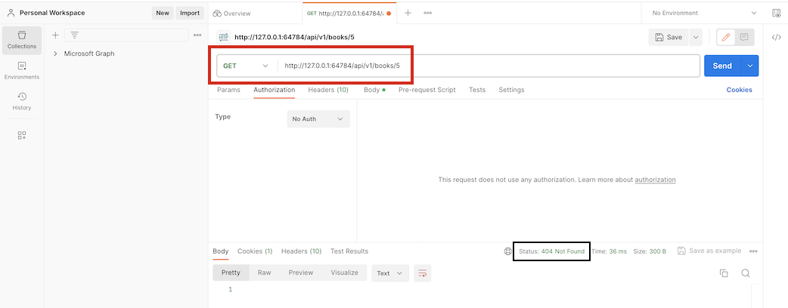

### GET /actuator/health

An "ADMIN" user can access the app health endpoint:

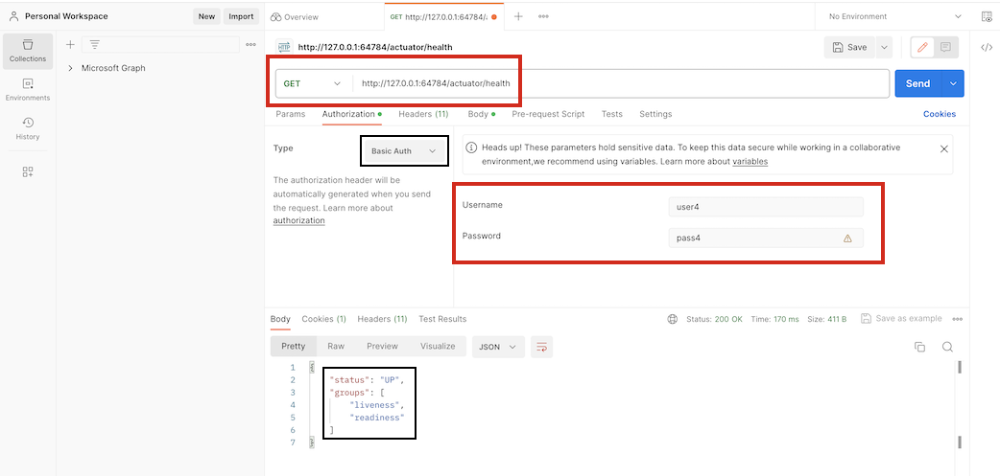

You can play around with the rest of the endpoints on your own.

>Note: While working on this project, I used a macOS machine. I believe someone following along on a Windows or Linux machine should still end up with the same results.

## Moving to production

### Deploying on AWS

I'd go with AWS because it's the cloud provider that I'm most familiar with.

There are a few different ways of deploying Java applications on AWS:

- Deploying on EC2. With this option, you'll be required to manage the server(s)/EC2 instance(s) on your own - in addition to your app's dependencies, etc.
- Deploying on Elastic Beanstalk. This allows you to quickly deploy and manage your application on AWS without dealing with the underlying infrastructure that runs the application. Check out [Creating and deploying Java applications on Elastic Beanstalk](https://docs.aws.amazon.com/elasticbeanstalk/latest/dg/create_deploy_Java.html).
- Deploying on Amazon Elastic Kubernetes Service (EKS). For a microservices-based/containerized solution, this would be the best deployment type (and the one that I would probably go with, having deployed our app to a local Kubernetes cluster using minikube). Check out [Deploy a sample Java microservice on Amazon EKS and expose the microservice using an Application Load Balancer](https://docs.aws.amazon.com/prescriptive-guidance/latest/patterns/deploy-a-sample-java-microservice-on-amazon-eks-and-expose-the-microservice-using-an-application-load-balancer.html).
- Deploying on AWS Lambda. This is a serverless compute solution, where the burden of server/infrastructure management is offloaded to the service provider. Check out [Java on AWS Lambda workshop](https://catalog.workshops.aws/java-on-aws-lambda) for more information.

>Note: This isn't a comprehensive look at deployment on AWS. For a deeper coverage of the above deployment options, you can check out the AWS documentation for the specific services.

### What I would change in a production environment

Here are a few things that I would do differently in a production environment:
- As you've probably noted, currently the `books` and `users` tables are contained in the same database. In production, I would probably store the users in a different DB. Storing users' (potentially sensitive) data separately makes for a more secure (and resilient) database management architecture.
- Also, for development purposes, we've used a light-weight in-memory database (H2). In production, I'd definitely use a production-grade database (PostgreSQL or MySQL). On AWS, that would translate to using RDS with a PostgreSQL or MySQL engine.
- In a production setup, I'd implement caching solutions to improve app performance (by reducing latency for read-heavy operations).

## Areas of improvement

- **Auth/Access control**: Currently, any registered user with the role of "USER" can edit/update the details of another user's book. Ideally, this shouldn't be the case. Every book should be associated with a particular user (the so-called "owner" of the book). Only the "owner" or "creator" of a book should be allowed to update it.
- **Better search functionality**: Currently, the `/api/v1/books/search/{title}` endpoint offers very rudimentary search capability. For example, the search term should match the title of the book **exactly**, otherwise, you get a 404 (Not Found). 
- **Better way of generating ISBNs**: Currently, we are just picking random numbers that don't conform to the ISBN standards. You can read more about [ISBN on Wikipedia](https://en.wikipedia.org/wiki/ISBN).
- **More/better tests and error handling**: This is an area that I'm *still improving on myself*.

>Note: These areas can also serve as exercises to the reader.

## Conclusion

I really enjoyed putting this together. It was a way for me to learn more about Kubernetes (and containerization in general), especially in the Java/Spring Boot space. If you spot any errors, please let me know.
